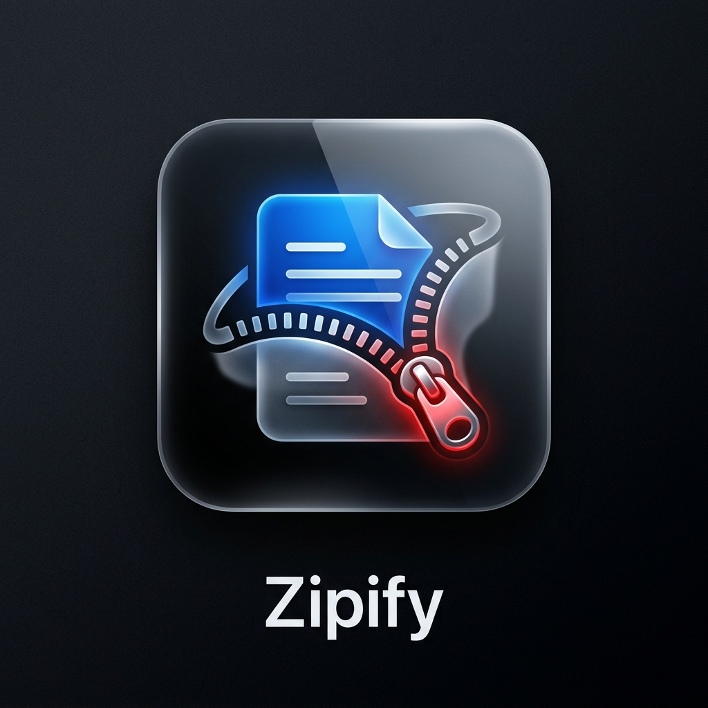

# ⚡ Zipify Tools Mega Suite



**Zipify Tools** is a premium, 100% secure, and entirely client-side file utility application built with React and Vite. Designed to handle all your daily file manipulation needs directly in your browser without ever uploading your sensitive data to a server.

**Designed and Developed by [Vikas Daddi](https://github.com/Vikas-daddi)**

🌍 **Live Demo:** [https://zipify-tools.vercel.app](https://zipify-tools.vercel.app)

---

## 🔒 100% Secure & Local
Unlike most online file utilities that upload your documents to remote servers for processing, **Zipify Tools operates entirely on your device**. All compression, conversion, and packaging algorithms are executed directly in your browser using modern Web APIs and WebAssembly. Your files are completely private.

---

## ✨ Features

### 🖼️ Image Tools
- **Image Compressor:** Drastically reduce image file sizes while maintaining incredible visual fidelity. Real-time background size estimation.
- **Image Converter:** Seamlessly convert images between PNG, JPEG, and WEBP formats.
- **Image Resizer:** Quickly resize images to exact pixel dimensions while maintaining aspect ratios.
- **Image to PDF:** Select multiple images and bundle them cleanly into an A4-sized PDF document.

### 📄 PDF Tools
- **PDF Compressor (Dual Mode):**
  - *Structure Optimization:* Strips metadata and unused objects while preserving perfectly crisp, selectable text.
  - *Deep Compression (Rasterization):* Need massive file size reduction? This mode converts PDF pages into heavily compressed images, shrinking 4MB+ PDFs down to mere kilobytes.
- **Merge PDFs:** Combine multiple separate PDF documents into a single, cohesive file.
- **Split PDF:** Automatically extract every page of a PDF into individual files, instantly delivered as a ZIP archive.

### 📦 Archive Tools
- **Create ZIP:** Select unlimited files of any type and instantly compress them into a `.zip` archive for easy sharing.

---

## 🎨 Premium UI/UX
- **Glassmorphism Design:** Beautiful frosted glass panels over animated mesh gradients.
- **Smart Estimation:** The app calculates estimated output sizes in the background as you adjust quality sliders.
- **Custom Naming:** Rename your output files on the fly right before downloading.

---

## 🛠️ Technology Stack
- **Framework:** React + Vite
- **Styling:** Vanilla CSS (Glassmorphism + Outfit Font)
- **PDF Manipulation:** `pdf-lib` & `jspdf`
- **Rasterization:** `pdfjs-dist` (Mozilla PDF.js)
- **Image Processing:** `browser-image-compression`
- **Archives:** `jszip` & `file-saver`
- **Icons:** `lucide-react`

---

## 🚀 Quick Start (Running Locally)

1. **Clone the repository**
   ```bash
   git clone https://github.com/Vikas-daddi/zipify-tools.git
   cd zipify-tools
   ```

2. **Install dependencies**
   ```bash
   npm install
   ```

3. **Start the development server**
   ```bash
   npm run dev
   ```

4. **Build for production**
   ```bash
   npm run build
   ```

---
*Built with passion for speed, privacy, and beautiful design.*
